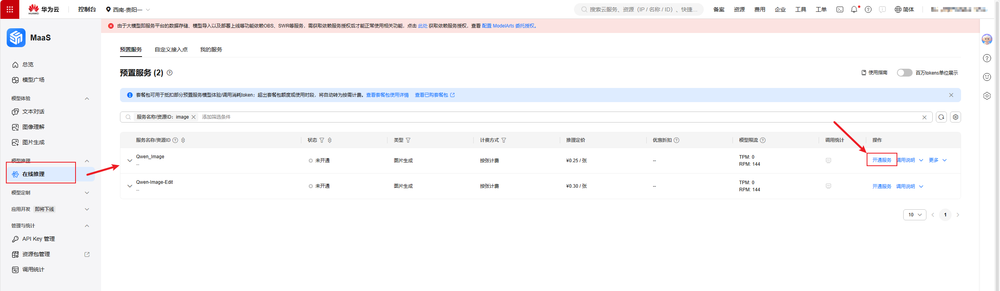
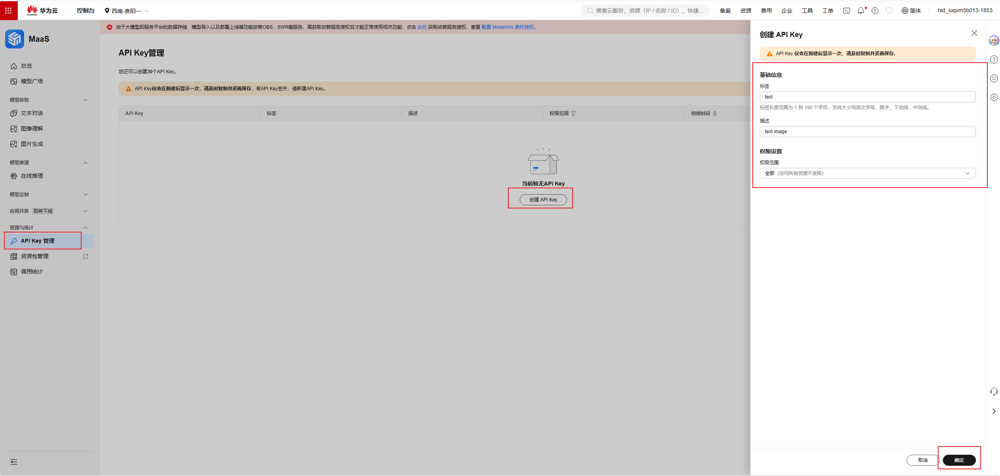

# 开通华为云MaaS文生图服务

## 第一步：开通模型

访问控制台：https://console.huaweicloud.com/modelarts/?region=cn-southwest-2#/model-studio/deployment



操作步骤：
1. 登录华为云控制台
2. 进入 ModelArts → 模型工作室 → 模型部署
3. 在模型广场搜索 **Qwen-image**
4. 点击「部署」或「开通」
5. 选择部署配置（可使用默认配置）
6. 等待模型部署完成（通常几分钟）

---

## 第二步：获取API Key



操作步骤：
1. 部署完成后，进入模型详情页
2. 找到「API Key管理」或「获取密钥」
3. 点击「创建API Key」
4. 输入Key名称（如：xhs-image-gen）
5. 点击确认，复制生成的API Key

⚠️ **重要提示**：
- API Key 只显示一次，请立即保存
- 不要将 API Key 提交到代码仓库
- 如果泄露，请立即删除并重新创建

---

## 第三步：配置API Key

### 方式1：环境变量（推荐）

```bash
# Linux/Mac
export MAAS_API_KEY="你的API Key"

# 添加到 ~/.bashrc 永久生效
echo 'export MAAS_API_KEY="你的API Key"' >> ~/.bashrc
```

### 方式2：配置文件

创建配置文件：

```bash
mkdir -p config
```

```json
// config/maas.json
{
  "api_key": "你的API Key"
}
```

---

## 验证配置

运行测试：

```bash
python skills/huawei-maas-image/scripts/maas_image_gen.py "测试图片" --size 512x512
```

如果成功生成图片，说明配置正确。

---

## 常见问题

### Q: 模型部署失败？
A: 检查华为云账户是否有足够余额，部分区域可能需要申请开通。

### Q: API Key无效？
A: 确认Key是否正确复制，检查是否有多余空格或换行。

### Q: 生成图片失败？
A: 检查网络连接，确认API Key未过期，查看错误信息。
